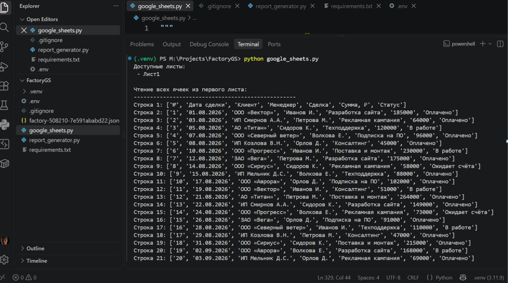
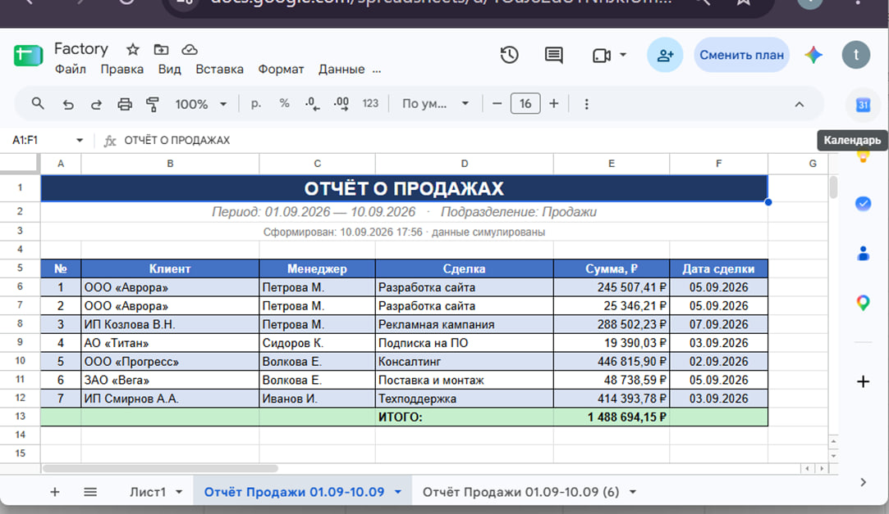

<p align="center">
  <a href="https://github.com/igormikt/FactoryGS">
    
  </a>
</p>

# FactoryGS — автоматический отчёт в Google Sheets 📊

Проект-прототип: **генератор отчётов о продажах** с записью в Google Таблицу.
Desktop-приложение на tkinter формирует случайные данные отчёта и создаёт в таблице новый лист, оформленный «как вордовский документ»: объединённая шапка, заливки, шрифты, границы, денежный формат, строка «ИТОГО», закреплённая шапка таблицы.

Подключение к Google выполнено через **сервисный аккаунт** (server-to-server, без OAuth-окон): таблица просто расшаривается email-ом сервисного аккаунта, как обычному пользователю.

## Возможности

- **`google_sheets.py`** — переиспользуемый ООП-модуль-обёртка над Google Sheets API v4:
  - CRUD: `read_all_cells`, `write_range`, `update_cell`, `append_row`, `delete_row`, `clear_range`;
  - листы и форматирование: `create_sheet`, `merge_cells`, `format_range`,
    `set_borders`, `set_column_width`, `freeze_rows`;
  - пакетный режим `*_request` + `batch_update()` — всё форматирование уходит
    **одним** API-запросом (защита от квоты 60 write-запросов/мин, ошибка 429);
  - учтены «подводные камни»: неразрывный пробел `\xa0` вычищается при чтении,
    `value_input_option='RAW'` не даёт знакам `+`/`=` превратиться в формулы с `#ERROR!`.
- **`report_generator.py`** — симулятор генератора отчётов (tkinter):
  поля «период с/по», «подразделение», «число строк» → кнопка → готовый отчёт в таблице;
  при превышении квоты (HTTP 429) операция автоматически повторяется через 61 секунду.
- Конфигурация через `.env`; JSON-ключ сервисного аккаунта находится в папке проекта автоматически.

  <p align="center">
  <a href="https://github.com/igormikt/FactoryGS">
    
  </a>
</p>

<p align="center">
  <a href="https://github.com/igormikt/FactoryGS">
    
  </a>
</p>

<p align="center">
  <a href="https://github.com/igormikt/FactoryGS">
    
  </a>
</p>

## Стек

Python 3.11+ · google-api-python-client · google-auth · google-auth-httplib2 · tkinter (стандартная библиотека)

## Структура проекта

```text
FactoryGS/
├── google_sheets.py        # модуль: CRUD + форматирование Google Sheets (ООП)
├── report_generator.py     # tkinter-приложение «Генератор отчётов»
├── requirements.txt        # зависимости
├── .env                    # SPREADSHEET_ID 
├── .gitignore
├── README.md
├── screenshots/            # скриншоты для отчёта по ДЗ
└── <key>.json              # JSON-ключ сервисного аккаунта (НЕ публикуется)
```

## Настройка и запуск

### Шаг 1. Google Cloud Console

1. Создайте проект: `Select Project → New Project` (например, `Excel Factory`).
2. `APIs & Services → Library` → найдите **Google Sheets API** → **Enable**.
3. `APIs & Services → Credentials → Create credentials → Service account`:
   имя (например, `backend`), роль **Owner** или **Editor** → Done.
4. Откройте созданный аккаунт → вкладка **Keys → Add key → Create new key → JSON**:
   файл ключа скачается на компьютер.
5. **Критично:** откройте вашу Google Таблицу → **«Настройки доступа»** →
   добавьте email сервисного аккаунта (`backend@<project-id>.iam.gserviceaccount.com`)
   с правом **«Редактор»**. Без этого шага API вернёт `403 The caller does not have permission`.

### Шаг 2. Локально

```bash
git clone <ссылка на ваш репозиторий>
cd FactoryGS
python -m venv .venv
.venv\Scripts\activate          # Windows (PowerShell); Linux/macOS: source .venv/bin/activate
pip install -r requirements.txt
```

3. Положите скачанный JSON-ключ в корень проекта (в репозиторий он не попадает — см. `.gitignore`).
4. Создайте `.env` по образцу:

```env
# Кусок URL таблицы между /d/ и /edit
SPREADSHEET_ID=ВСТАВЬТЕ_ID_ТАБЛИЦЫ
# Необязательно: без этой строки модуль сам найдёт JSON-ключ в папке
# CREDENTIALS_PATH=factory-000000-abcdef123456.json
```

### Шаг 3. Запуск

```bash
# Проверка подключения: список листов + чтение всех ячеек
python google_sheets.py

# Графический симулятор отчётов
python report_generator.py
```

В окне приложения укажите период, подразделение и число строк →
**«Сгенерировать отчёт»** → в таблице появится новый оформленный лист.

## Краткий справочник по `GoogleSheets`

| Метод | Назначение |
|---|---|
| `read_all_cells(sheet_name=None)` | все ячейки листа (с очисткой `\xa0`) |
| `write_range(range, values)` | запись блока строк в диапазон |
| `update_cell(addr, value)` | точечное обновление ячейки |
| `append_row(values)` | добавить строку в конец |
| `delete_row(n)` / `clear_range(range)` | удалить строку / очистить диапазон |
| `create_sheet(title)` | новый лист (имя уникализируется автоматически) |
| `merge_cells`, `format_range`, `set_borders` | объединение, цвета/шрифты/форматы, границы |
| `set_column_width`, `freeze_rows` | ширины колонок, закрепление строк |
| `*_request(...)` + `batch_update(list)` | собрать много операций в ОДИН запрос (экономия квоты) |

## Траблшутинг

| Симптом | Причина / решение |
|---|---|
| `403 The caller does not have permission` | таблица не расшарена email-у сервисного аккаунта (Шаг 1.5) |
| `404 Not found` | неверный `SPREADSHEET_ID` в `.env` или ключ от другого проекта |
| `429 Quota exceeded ... Write requests` | превышена минутная квота записей: подождите 60 с (или используйте `batch_update`) |
| `\xa0` в выводе | артефакт денежного формата ячеек, модуль вычищает автоматически |
| `#ERROR!` вместо значения | значение записано как формула: используйте строки + `RAW` |

## Безопасность

- JSON-ключ сервисного аккаунта и `.env` **никогда не публикуются** (см. `.gitignore`).
- Для воспроизведения проекта достаточно создать свой ключ и `.env` по инструкции выше.
- Роль сервисного аккаунта в учебном проекте ограничена рамками одного GCP-проекта.

## Лицензия

Учебный проект. Свободно используйте код как заготовку для своих автоматизаций.

**Автор:** <IGOR_M>, 2026
